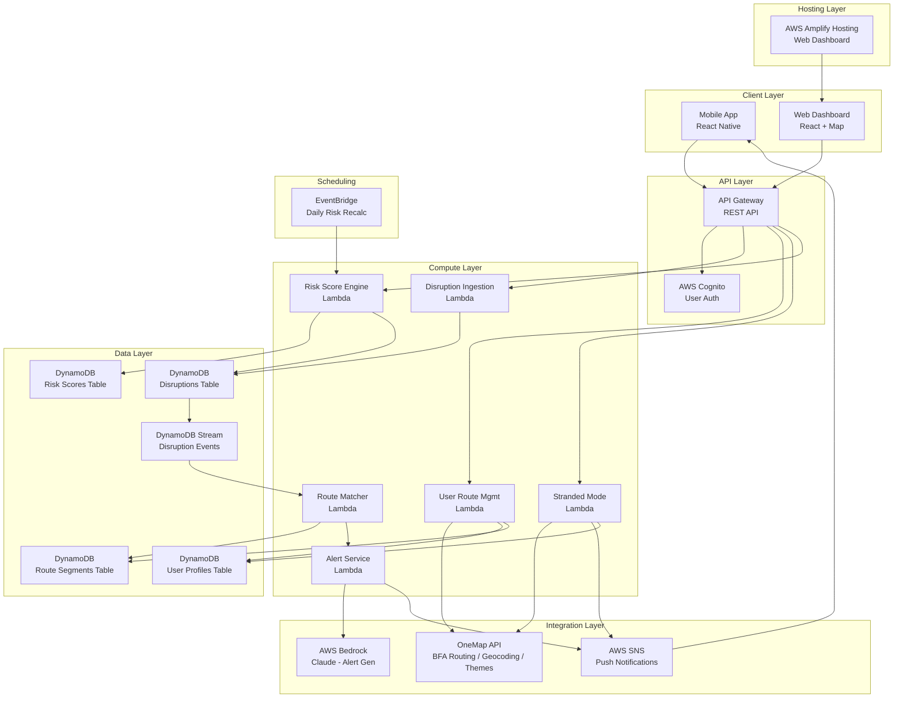
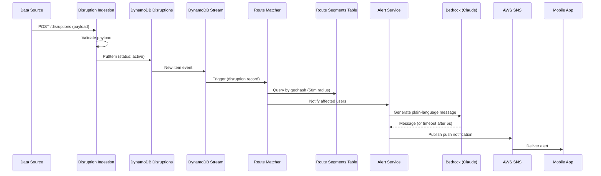

# Design Document: RouteGuard

## Overview

RouteGuard is a serverless mobile application orchestration layer that integrates Singapore's OneMap Barrier-Free Access (BFA) routing with AWS services to deliver real-time accessibility disruption alerts for persons with disabilities. The system ingests disruption data, matches disruptions to users' saved BFA routes, generates plain-language alerts via AWS Bedrock (Claude), and provides Stranded Mode SOS functionality.

The architecture follows an event-driven serverless pattern using AWS Lambda for compute, DynamoDB for persistence, SNS for push notifications, API Gateway for the REST interface, Cognito for authentication, and Bedrock for natural language generation. The OneMap API provides BFA routing, geocoding, and thematic data for help points.

### Key Design Decisions

1. **Geohashing for proximity matching** — DynamoDB lacks native geospatial queries. We use geohash-based indexing (precision level 6, ~1.2km cells) to efficiently find routes within 50m of a disruption without scanning every record.
2. **Event-driven Route Matching** — DynamoDB Streams trigger the Route_Matcher Lambda when new disruptions are stored, ensuring near-real-time matching without polling.
3. **Fallback template for alert generation** — If AWS Bedrock times out (>5s), a structured template produces the alert message, guaranteeing delivery within SLA.
4. **Geohash-indexed route segments** — BFA routes are decomposed into segments and indexed by geohash, enabling efficient proximity queries against the disruption table. **(MVP Fallback Note: If implementation time runs short before the MVP deadline, the geohash segment-indexing approach can be simplified to whole-route storage with brute-force distance checking against all route coordinates. This trades query efficiency for implementation simplicity — acceptable at MVP scale with a small number of users and routes.)**
5. **Amplify Hosting for companion web dashboard** — AWS Amplify Hosting serves a lightweight React web dashboard for live demos during the competition. The dashboard reads from the same DynamoDB tables (via API Gateway) and visualizes saved routes, active disruptions, and risk scores on an interactive map.

## Architecture



### Data Flow Sequence — Disruption Alert



## Components and Interfaces

### 1. Disruption Ingestion Service (Lambda)

**Endpoint:** `POST /disruptions`

**Request Schema:**
```json
{
  "location": {
    "latitude": 1.3521,
    "longitude": 103.8198
  },
  "disruptionType": "lift_breakdown",
  "timestamp": "2025-01-15T08:30:00Z",
  "description": "Lift at Block 123 is out of service",
  "source": "lta_feed"
}
```

**Validation Rules:**
- `latitude` must be between 1.15 and 1.47 (Singapore bounds)
- `longitude` must be between 103.60 and 104.05 (Singapore bounds)
- `disruptionType` must be one of: `lift_breakdown`, `escalator_breakdown`, `blocked_ramp`, `blocked_path`, `construction`, `flooding`, `other`
- `timestamp` must be valid ISO 8601

**Resolution Endpoint:** `PUT /disruptions/{disruptionId}/resolve`

**Query Endpoint:** `GET /disruptions?status=active` — Returns all active disruptions (used by web dashboard for map visualization)

**Responses:**
- `201 Created` — disruption stored successfully
- `400 Bad Request` — validation failure with field-level errors
- `404 Not Found` — resolution references non-existent disruption
- `500 Internal Server Error` — DynamoDB write failure

### 2. Route Matcher (Lambda)

**Trigger:** DynamoDB Stream on Disruptions table (INSERT events for active disruptions)

**Process:**
1. Extract disruption location and compute geohash (precision 6)
2. Query Route Segments table using geohash and neighboring cells
3. For each candidate route segment, compute Haversine distance
4. Filter to segments within 50m of disruption
5. Resolve affected User_Profiles from matched route segments
6. Invoke Alert Service for each affected user with disruption + route context

**Error Handling:**
- On failure: log error, retry once, then mark disruption as `unmatched` for manual review

### 3. Alert Service (Lambda)

**Interface:**
```typescript
interface AlertRequest {
  userId: string;
  routeId: string;
  disruption: DisruptionRecord;
  departureStatus: "pre_departure" | "en_route";
  userLocation?: { latitude: number; longitude: number };
}
```

**Behavior:**
- Invokes Alert_Message_Generator (Bedrock) with disruption context
- If Bedrock response exceeds 5 seconds, falls back to template message
- Publishes to SNS platform endpoint for the user's device
- Includes deep link to map view centered on disruption coordinates
- Enforces deduplication: at most one alert per disruption per user per route (unless status changes)

**Departure Status Logic:**
- "pre_departure": user's last known location is within 100m of route origin
- "en_route": user's location is along the route beyond 100m from origin, and disruption is at least 200m ahead

### 4. Alert Message Generator (Bedrock Claude)

**Input:**
```json
{
  "disruptionType": "lift_breakdown",
  "location": "Block 123 Ang Mo Kio Ave 3",
  "routeName": "Home to MRT",
  "userAction": "Use ramp at Block 125 instead"
}
```

**Constraints:**
- Output ≤ 450 characters
- Reading level ≤ Grade 6 (Flesch-Kincaid)
- Must include: what happened, where, what to do next
- No abbreviations/jargon without inline explanation
- Complete within 5 seconds

**Prompt Template:**
```
You are writing a mobile notification for a person with a disability. 
Write in simple English at a Grade 6 reading level or below.
Keep the message under 450 characters.
Include: what happened, where it happened, and what to do next.
Do not use abbreviations or jargon.

Disruption: {disruptionType}
Location: {location}
Route: {routeName}
Suggested action: {userAction}
```

### 5. User Route Management (Lambda)

**Endpoints:**
- `GET /routes/search?origin={address}&destination={address}` — Geocode + BFA route
- `POST /routes` — Save a BFA route to profile (max 10)
- `DELETE /routes/{routeId}` — Remove a saved route
- `GET /routes` — List saved routes

**Geocoding Flow:**
1. Call OneMap Geocoding API with address input
2. If multiple results: return top 5 for user selection
3. If zero results: return error prompting user to refine input
4. Once coordinates resolved: call OneMap BFA Routing endpoint

**Route Storage:**
- Decompose route geometry into segments
- Compute geohash for each segment midpoint
- Store in Route Segments table indexed by geohash (for Route Matcher queries)
- Store full route in User Profile for display

### 6. Risk Score Engine (Lambda)

**Triggers:**
- DynamoDB Stream: when disruption status changes to "resolved"
- EventBridge: daily scheduled recalculation

**Risk Score Formula:**
```
score = min(100, (count_30d × 2) + (count_31_90d × 1))
```
Where:
- `count_30d` = number of resolved disruptions at this Location_Node within the past 30 days
- `count_31_90d` = number of resolved disruptions from 31–90 days ago
- Disruptions older than 90 days are excluded

**Endpoint:** `GET /routes/{routeId}/risk-scores` — Returns risk scores for all Location_Nodes along the route

### 7. Stranded Mode Service (Lambda)

**Endpoint:** `POST /sos`

**Request:**
```json
{
  "currentLocation": { "latitude": 1.3521, "longitude": 103.8198 },
  "activeRouteId": "route-123"  // optional
}
```

**Process (parallel where possible):**
1. Request BFA reroute from OneMap (current location → original destination)
2. Send caregiver notifications via SNS
3. Query OneMap thematic layer for Help_Points within 500m (expand to 1000m if zero found)
4. Return combined response within 10 seconds

**Error States:**
- No location available → prompt to enable location services
- No active route → skip rerouting
- Reroute fails → show Help_Points and caregiver status only
- No caregivers configured → skip notification, inform user

### 8. Authentication (AWS Cognito)

- User pool with email/phone sign-up
- JWT tokens for API Gateway authorization
- Cognito identity linked to DynamoDB User_Profile
- Protected endpoints: all except health check

### 9. Companion Web Dashboard (AWS Amplify Hosting)

**Purpose:** A lightweight React web application hosted on AWS Amplify, designed for live demos during the competition. Provides a visual overview of RouteGuard's data on an interactive map.

**Hosting:** AWS Amplify Hosting (CI/CD from Git, automatic builds and deploys)

**Features:**
- **Saved Routes on Map** — Displays all saved BFA_Routes as polylines on an interactive map (Leaflet/MapLibre with OneMap tile layer)
- **Active Disruptions on Map** — Shows currently active disruptions as map markers with icons indicating disruption type, refreshing on a short polling interval (10s)
- **Risk Scores Overlay** — Overlays risk score values on Location_Nodes along displayed routes, color-coded by severity (green 0–30, amber 31–60, red 61–100)

**Data Access:**
- Reads from the same API Gateway endpoints used by the mobile app (`GET /routes`, `GET /disruptions?status=active`, `GET /routes/{routeId}/risk-scores`)
- Authenticates via AWS Cognito (shared user pool with mobile app) or uses a read-only demo token for competition presentation

**Technology Stack:**
- React (Vite build)
- Leaflet or MapLibre GL JS with OneMap basemap tiles
- Amplify Hosting for static site deployment
- Cognito SDK for authentication

## Data Models

### Disruptions Table

| Attribute | Type | Description |
|-----------|------|-------------|
| `disruptionId` | String (PK) | UUID |
| `geohash` | String (GSI-PK) | Geohash precision 6 |
| `status` | String (GSI-SK) | `active` / `resolved` |
| `latitude` | Number | Disruption latitude |
| `longitude` | Number | Disruption longitude |
| `disruptionType` | String | Enum value |
| `timestamp` | String | ISO 8601 creation time |
| `resolvedAt` | String | ISO 8601 resolution time (nullable) |
| `description` | String | Human-readable description |
| `source` | String | Data source identifier |

**GSI: `geohash-status-index`** — PK: `geohash`, SK: `status` — enables querying active disruptions by geographic area.

### User Profiles Table

| Attribute | Type | Description |
|-----------|------|-------------|
| `userId` | String (PK) | Cognito identity ID |
| `email` | String | User email |
| `savedRoutes` | List (max 10) | Array of saved route objects |
| `caregivers` | List (max 3) | Array of caregiver contact objects |
| `snsEndpointArn` | String | SNS platform endpoint for push |
| `createdAt` | String | ISO 8601 |

**Saved Route Object:**
```json
{
  "routeId": "uuid",
  "routeName": "Home to Office",
  "origin": { "address": "Blk 123 ...", "latitude": 1.35, "longitude": 103.82 },
  "destination": { "address": "MRT Station ...", "latitude": 1.36, "longitude": 103.83 },
  "geometry": [[1.35, 103.82], [1.351, 103.821], ...],
  "createdAt": "2025-01-15T08:00:00Z"
}
```

**Caregiver Object:**
```json
{
  "name": "John",
  "phone": "+6591234567",
  "email": "john@example.com"
}
```

### Route Segments Table

> **MVP Fallback:** If implementation time runs short before the MVP deadline, this geohash segment-indexing approach can be simplified to whole-route storage with brute-force distance checking (iterate all coordinate pairs of all routes and compute Haversine distance to the disruption). This is acceptable at MVP scale with a small user/route count and avoids the complexity of segment decomposition and geohash indexing.

| Attribute | Type | Description |
|-----------|------|-------------|
| `geohash` | String (PK) | Geohash precision 6 of segment midpoint |
| `segmentId` | String (SK) | `{userId}#{routeId}#{segmentIndex}` |
| `userId` | String | Owner user ID |
| `routeId` | String | Parent route ID |
| `startLat` | Number | Segment start latitude |
| `startLng` | Number | Segment start longitude |
| `endLat` | Number | Segment end latitude |
| `endLng` | Number | Segment end longitude |
| `midLat` | Number | Segment midpoint latitude |
| `midLng` | Number | Segment midpoint longitude |

This structure allows the Route Matcher to efficiently query all route segments near a disruption by geohash.

### Risk Scores Table

| Attribute | Type | Description |
|-----------|------|-------------|
| `locationNodeId` | String (PK) | Geohash + node identifier |
| `riskScore` | Number | 0–100 |
| `disruptionCount30d` | Number | Disruptions in past 30 days |
| `disruptionCount31_90d` | Number | Disruptions 31–90 days ago |
| `lastUpdated` | String | ISO 8601 last recalculation time |
| `disruptions` | List | Array of `{disruptionId, resolvedAt}` for history |

### Alert Deduplication Table

| Attribute | Type | Description |
|-----------|------|-------------|
| `userId#routeId#disruptionId` | String (PK) | Composite deduplication key |
| `alertedAt` | String | ISO 8601 timestamp |
| `lastDisruptionStatus` | String | Status when alert was sent |
| `ttl` | Number | DynamoDB TTL (auto-expire after 7 days) |


## Correctness Properties

*A property is a characteristic or behavior that should hold true across all valid executions of a system — essentially, a formal statement about what the system should do. Properties serve as the bridge between human-readable specifications and machine-verifiable correctness guarantees.*

### Property 1: Disruption payload validation

*For any* disruption payload, the validation function SHALL accept the payload if and only if latitude is within [1.15, 1.47], longitude is within [103.60, 104.05], disruptionType is one of the enumerated set, and timestamp is valid ISO 8601. For any invalid payload, the rejection response SHALL identify which specific fields failed validation.

**Validates: Requirements 1.1, 1.2**

### Property 2: Valid disruption storage invariant

*For any* valid disruption payload that passes validation, the stored record SHALL have status "active", contain a geospatial coordinate (geohash), and preserve all original input fields. For any disruption that is resolved, the stored record SHALL transition to status "resolved" with a resolution timestamp recorded.

**Validates: Requirements 1.3, 1.4, 1.6**

### Property 3: Route-disruption proximity matching

*For any* disruption location and set of route segments, the Route_Matcher SHALL identify exactly those routes with at least one segment whose midpoint is within 50 metres (Haversine distance) of the disruption, and SHALL trigger the Alert_Service for each matched user. This property holds bidirectionally: when a new disruption is stored (checking against existing routes) and when a new route is saved (checking against active disruptions).

**Validates: Requirements 2.1, 2.2, 2.4**

### Property 4: Resolved disruptions excluded from matching

*For any* disruption with status "resolved", the Route_Matcher SHALL NOT include it in proximity matching against any BFA_Routes, regardless of geographic proximity.

**Validates: Requirements 2.6**

### Property 5: Departure status classification

*For any* user location and route origin, the Alert_Service SHALL classify the user as "pre_departure" if and only if the Haversine distance from the user's location to the route origin is ≤ 100 metres, and "en_route" otherwise.

**Validates: Requirements 3.7**

### Property 6: En-route alert distance threshold

*For any* user classified as "en_route" on a BFA_Route and any new disruption on that route, the Alert_Service SHALL send an en-route alert if and only if the disruption is at least 200 metres ahead of the user's current position along the route.

**Validates: Requirements 3.2**

### Property 7: Alert deduplication

*For any* combination of (userId, routeId, disruptionId), the Alert_Service SHALL send at most one alert notification. A subsequent alert for the same combination SHALL only be sent if the disruption status has changed since the previous alert.

**Validates: Requirements 3.6**

### Property 8: Alert notification deep link

*For any* alert notification sent, the notification payload SHALL contain a deep link URL that includes the disruption's latitude and longitude coordinates, enabling the mobile app to open a map view centered on the disruption.

**Validates: Requirements 3.4**

### Property 9: Saved route data completeness

*For any* BFA_Route saved by a user, the stored record SHALL contain: route geometry (ordered array of coordinate pairs), origin address, destination address, route name, and creation timestamp. No required field SHALL be null or missing.

**Validates: Requirements 4.3**

### Property 10: Route deletion ceases monitoring

*For any* BFA_Route that a user deletes, the route SHALL no longer appear in the User_Profile's saved routes, AND the route's segments SHALL be removed from the Route Segments table such that future disruptions will not match against the deleted route.

**Validates: Requirements 4.6**

### Property 11: Risk score calculation correctness

*For any* Location_Node with a history of resolved disruptions, the risk score SHALL equal `min(100, (count_within_30_days × 2) + (count_31_to_90_days × 1))` where disruptions older than 90 days are excluded from the calculation. The score SHALL always be an integer in the range [0, 100].

**Validates: Requirements 5.1, 5.2, 5.4, 5.5**

### Property 12: Caregiver notification on SOS

*For any* user with N designated caregivers (1 ≤ N ≤ 3) who activates Stranded Mode, the Stranded_Mode_Service SHALL send exactly N notifications, one to each caregiver, each containing the user's current location as a map link, a timestamp, and the SOS message text.

**Validates: Requirements 6.3**

### Property 13: Caregiver contact validation

*For any* contact input, the validation function SHALL accept the contact if and only if the phone field matches E.164 international format or the email field conforms to standard mailbox format (local-part@domain). For any contact that fails validation, the rejection SHALL identify which field is invalid.

**Validates: Requirements 7.4, 7.5**

### Property 14: Alert message output constraints

*For any* disruption data input (including inputs with missing fields), the Alert_Message_Generator (or its fallback template) SHALL produce a message that: (a) is ≤ 450 characters, (b) includes a description of what happened, where it happened, and what to do next when all data is available, and (c) indicates which information is unavailable when input fields are missing.

**Validates: Requirements 8.2, 8.4, 8.6**

## Error Handling

### Service-Level Error Strategy

| Service | Error Type | Handling |
|---------|-----------|----------|
| Disruption Ingestion | Validation failure | 400 response with field-level error details |
| Disruption Ingestion | DynamoDB write failure | 500 response, log error with request context |
| Disruption Ingestion | Non-existent disruption ID on resolve | 404 response |
| Route Matcher | Matching process failure | Log error, retry once, mark as `unmatched` |
| Alert Service | Bedrock timeout (>5s) | Fall back to template-based message |
| Alert Service | SNS delivery failure | Log failure, store in dead-letter queue for retry |
| User Route Management | OneMap BFA Routing unavailable | User-facing error: "routing temporarily unavailable" |
| User Route Management | Geocoding returns zero results | Prompt user to refine address input |
| User Route Management | Max routes (10) exceeded | 409 Conflict response with limit message |
| Risk Score Engine | Calculation failure | Return "unavailable" indicator for affected nodes |
| Stranded Mode | Location unavailable | Error message: "enable location services" |
| Stranded Mode | BFA reroute fails | Proceed with Help_Points and caregiver notification |
| Stranded Mode | No caregivers configured | Skip notification, inform user |
| Stranded Mode | Zero Help_Points within 500m | Expand search to 1000m |
| Authentication | Invalid/expired token | 401 response, redirect to login |

### Retry Policy

- **Route Matcher**: 1 retry with exponential backoff (initial 1s)
- **SNS publish**: 2 retries via AWS SDK default retry
- **OneMap API calls**: 2 retries with 2s timeout per attempt
- **Bedrock invocation**: No retry (hard 5s timeout, fall back to template)
- **DynamoDB operations**: AWS SDK default retry (3 attempts)

### Dead Letter Queues

- **Unmatched disruptions**: Disruptions that fail matching after retry are written to a DynamoDB `unmatched_disruptions` table for manual review
- **Failed SNS notifications**: SNS topic configured with SQS dead-letter queue for undeliverable messages

## Testing Strategy

### Unit Tests

Unit tests cover specific examples, edge cases, and error conditions:

- **Validation logic**: Boundary values for lat/lng, each disruption type, malformed timestamps
- **Geohash computation**: Known coordinate → expected geohash mapping
- **Departure status**: Exact 100m boundary, 99m (pre-departure), 101m (en-route)
- **Risk score**: Zero disruptions, capped at 100, exactly 30/31/90/91 day boundaries
- **Route limit enforcement**: 9 routes (success), 10 routes (success), 11th route (rejection)
- **Caregiver limit enforcement**: 3 caregivers max
- **Template fallback**: Bedrock timeout scenario produces valid template message
- **Deep link formatting**: Coordinate pairs produce valid URL format

### Property-Based Tests

Property-based tests verify universal properties across randomized inputs, using **fast-check** (TypeScript) as the PBT library. Each test runs a minimum of 100 iterations.

| Property | Test Description | Tag |
|----------|-----------------|-----|
| Property 1 | Generate random payloads, verify validation correctness | Feature: routeguard, Property 1: Disruption payload validation |
| Property 2 | Generate valid payloads, verify storage invariants | Feature: routeguard, Property 2: Valid disruption storage invariant |
| Property 3 | Generate disruption/route pairs, verify 50m matching | Feature: routeguard, Property 3: Route-disruption proximity matching |
| Property 4 | Generate resolved disruptions, verify exclusion | Feature: routeguard, Property 4: Resolved disruptions excluded |
| Property 5 | Generate user positions and route origins, verify classification | Feature: routeguard, Property 5: Departure status classification |
| Property 6 | Generate en-route positions and disruptions, verify 200m threshold | Feature: routeguard, Property 6: En-route alert distance threshold |
| Property 7 | Generate duplicate matching events, verify single alert | Feature: routeguard, Property 7: Alert deduplication |
| Property 8 | Generate coordinates, verify deep link presence and format | Feature: routeguard, Property 8: Alert deep link |
| Property 9 | Generate route data, verify all fields persisted | Feature: routeguard, Property 9: Saved route completeness |
| Property 10 | Generate routes then delete, verify removal from matching | Feature: routeguard, Property 10: Route deletion ceases monitoring |
| Property 11 | Generate disruption histories, verify risk score formula | Feature: routeguard, Property 11: Risk score calculation |
| Property 12 | Generate users with 1-3 caregivers, verify all notified | Feature: routeguard, Property 12: Caregiver notification on SOS |
| Property 13 | Generate contact strings, verify validation accepts/rejects correctly | Feature: routeguard, Property 13: Caregiver contact validation |
| Property 14 | Generate disruption data with random missing fields, verify output constraints | Feature: routeguard, Property 14: Alert message output constraints |

### Integration Tests

Integration tests verify end-to-end flows and external service interactions:

- **Disruption → Alert pipeline**: Submit disruption, verify alert arrives at SNS endpoint
- **OneMap BFA Routing**: Verify BFA route request and response parsing
- **OneMap Geocoding**: Verify address resolution flow
- **Cognito authentication**: Verify token validation and profile creation
- **DynamoDB Stream → Lambda trigger**: Verify stream event activates Route Matcher
- **Bedrock message generation**: Verify Claude produces Grade 6 messages with required elements
- **EventBridge → Risk Score recalculation**: Verify daily schedule triggers correctly
- **Stranded Mode end-to-end**: Verify reroute + notification + Help_Points within 10s SLA
- **SNS push delivery**: Verify notifications reach device endpoints

### Smoke Tests

- MVP seed data: Verify ≥10 sample disruption records are present after deployment
- Authentication: Verify unauthenticated requests receive 401
- API Gateway: Verify all endpoints respond (health check)
